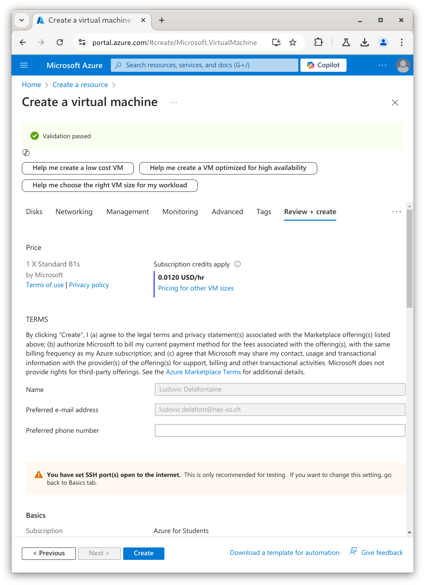
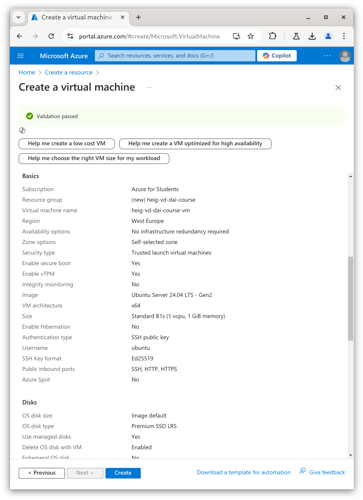
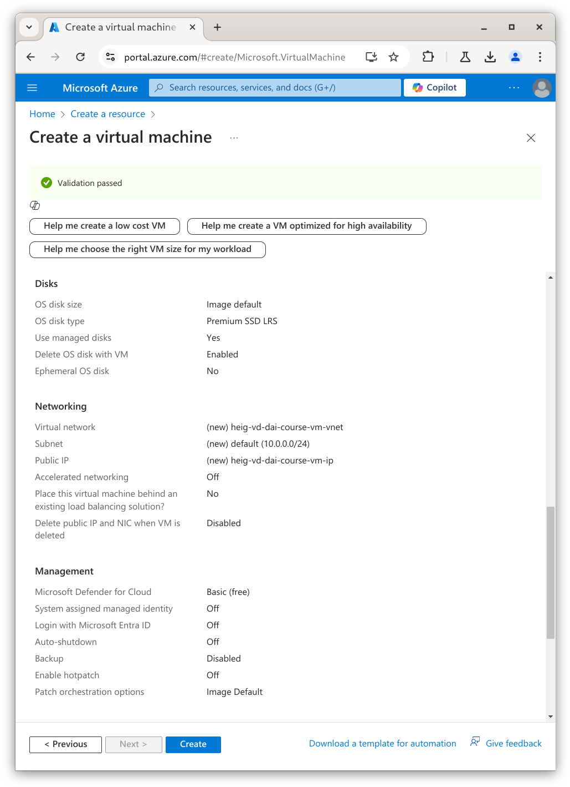
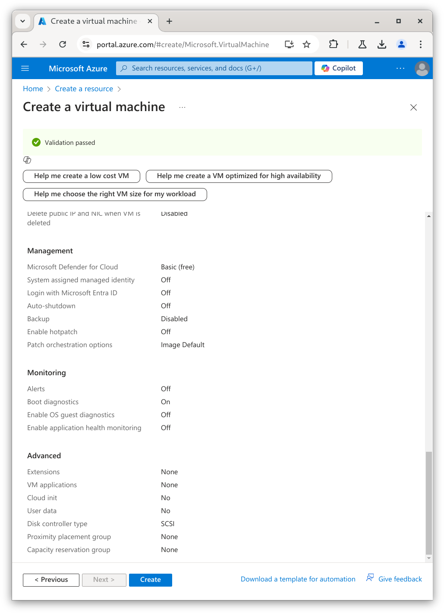
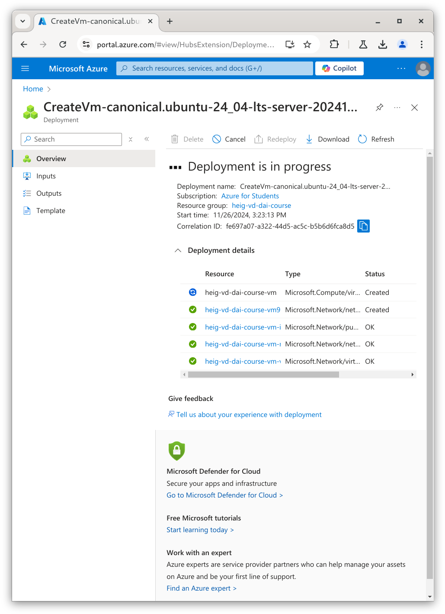
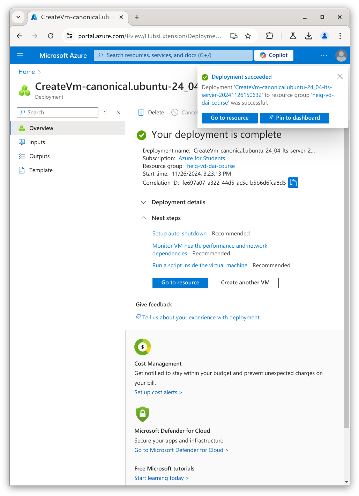

# Deploy the app

## Publish with Docker

### Create a personal access token

You will need a personal access token to publish an image on GitHub Container
Registry.

A personal access token is a token that you can use to authenticate to GitHub
instead of using your password. It is more secure than using your password.

Follow the instructions on the official website to authenticate with a personal
access token (classic):
<https://docs.github.com/en/packages/working-with-a-github-packages-registry/working-with-the-container-registry>.

> [!NOTE]
>
> You can find the personal access token in the settings of your GitHub account:
> **Settings** > **Developer settings** (at the very end of the left side bar) >
> **Personal access tokens** > **Tokens (classic)**.

### Login to GitHub Container Registry

Login to GitHub Container Registry with the following command, replacing
`<username>` with your GitHub username:

```sh
# Login to GitHub Container Registry
docker login ghcr.io -u <username>
```

When asked for the password, use the personal access token you created earlier.

The output should be similar to the following:

```text
Login Succeeded
```

### Tag the image correctly for GitHub Container Registry

The image must be tagged with the following format:
`ghcr.io/<username>/<image>:<tag>`.

Run the following command to tag the image with the correct format, replacing
`<username>` with your GitHub username:

```sh
# Tag the image with the correct format
docker tag java-ios-docker ghcr.io/<username>/java-ios-docker:latest
```

You can list all the images with the following command:

```sh
# List all the images
docker images
```

The output should be similar to the following:

```text
REPOSITORY                                                                                    TAG       IMAGE ID       CREATED         SIZE
java-ios-docker                                                                               latest    8214c1a1c97c   3 minutes ago   282MB
ghcr.io/ludelafo/java-ios-docker                                                              latest    8214c1a1c97c   3 minutes ago   282MB
```

You can delete the local `java-ios-docker` image with the following command:

```sh
# Delete java-ios-docker image
docker rmi java-ios-docker
```

### Publish the image on GitHub Container Registry

Now publish the image on GitHub Container Registry with the following command,
replacing `<username>` with your GitHub username:

```sh
# Publish the image on GitHub Container Registry
docker push ghcr.io/<username>/java-ios-docker
```

The output should be similar to the following:

```text
The push refers to repository [ghcr.io/ludelafo/java-ios-docker]
130abe5d3a5e: Pushed
90ab30cf733e: Pushed
6cc5022303de: Pushed
750416b760e2: Pushed
f975d1357d1a: Pushed
0bf35e9086dc: Pushed
f36fd4bb7334: Pushed
latest: digest: sha256:d0d83a97c4522ddbeb8968e9d509fdebecf0450ca1651c13c14ca774f01e8675 size: 1784
```

You can now go to the GitHub Container Registry page of your repository to check
that the image has been published, replacing `<username>` with your GitHub
username: `https://github.com/<username>?tab=packages`.

As you can notice, the image is private by default. You can change the
visibility of the image in the settings of the image.

You can keep your images private if you want. Just be aware that you will need
to authenticate to GitHub Container Registry to pull the image.

You can delete the local image if you want.

Congrats! You have just published your first image on GitHub Container Registry!


## Set up a virtual machine

### Install and configure SSH (and SCP)

In this section, you will install and configure SSH on your operating system.
This will automatically install SCP as well.

#### Install the SSH client

The SSH client is available on most operating systems.

You certainly already have it installed on your operating system as you used it
in the
[Git, GitHub and Markdown](https://github.com/heig-vd-dai-course/heig-vd-dai-course/tree/main/03-git-github-and-markdown)
chapter.

If not, follow the instructions below to install it:

```sh
# Install the SSH client
sudo apt install openssh-client
```

### Check the installation

Open a terminal and type `ssh -V`.

The output should be similar to this:

```text
OpenSSH_9.6p1 Ubuntu-3ubuntu13.5, OpenSSL 3.0.13 30 Jan 2024
```

### Acquire a virtual machine on a cloud provider

In this section, you will acquire a virtual machine on a cloud provider.

Many other cloud providers exist and offer free tiers (= free resources for a
limited time). You can check the following Git repository for a list of cloud
providers offering free tiers:
<https://github.com/cloudcommunity/Cloud-Free-Tier-Comparison> if you want to
explore more on this topic.

In this course, we will use a virtual machine from
[Microsoft Azure](https://azure.microsoft.com).

Using your HES-SO email address, you can apply for the
[Azure for Students](https://azure.microsoft.com/en-us/free/students/) offer to
get free credits without the need for a credit card.

#### Access Microsoft Azure

Access the Azure portal with the following link: <https://portal.azure.com>.

Use your HES-SO email address to log in (`<first name>.<last name>@hes-so.ch`
where `<first name>` and `<last name>` are 8 characters max) and the password
you usually use to log in to the HES-SO services (GAPS, Cyberlearn, etc.).

#### Apply for the Azure for Students offer

Once you are logged in, you can apply for the Azure for Students offer with the
following link: <https://azure.microsoft.com/en-us/free/students/>.

If needed, log in with your HES-SO email address again.

Fill the form with your information and set up your account.

You should now have access to the Azure portal with free credits.

#### Create a virtual machine

Return to the Azure portal and create a new virtual machine from the dashboard
in section `Create a resource`.

Select a virtual machine with the following characteristics:

- **Project details**
    - **Subscription**: Azure for Students
    - **Resource group**: Create new with the name `heig-vd-dai-course`
- **Instance details**
    - **Virtual machine name**: `heig-vd-dai-course-vm`
    - **Region**: (Europe) West Europe
    - **Availability options**: No infrastructure redundancy required
    - **Security type**: Trusted launch virtual machines (the default)
    - **Image**: Ubuntu Server 24.04 LTS - x64 Gen2 (the default)
    - **VM architecture**: x64
    - **Size**: `Standard_B1s` - you might need to click _"See all sizes"_ to see
      this option
- **Administrator account**
    - **Authentication type**: SSH public key
    - **Username**: `ubuntu` - please use this username so the teaching staff can
      help you if needed
    - **SSH public key source**: Use existing public key
    - **SSH public key**: Paste your public key here - see the note below for more
      information
- **Inbound port rules**
    - **Public inbound ports**: Allow selected ports
    - **Select inbound ports**: HTTP (80), HTTPS (443), SSH (22)

> [!NOTE]
>
> You can use the same public key you used to sign your commits if Git as seen
> in the
> [Git, GitHub and Markdown](https://github.com/heig-vd-dai-course/heig-vd-dai-course/tree/main/03-git-github-and-markdown)
> chapter or you can generate a new one with the `ssh-keygen` command for the
> purpose of this chapter.

Although the `Standard_B1s` size is one of the
[cheapest](https://azure.microsoft.com/en-us/pricing/details/virtual-machines/linux/)
and least powerful option, it will be enough for this course. It will allow you
to use your remaining credits for other services.

Click on the `Review + create` button.

Validate the configuration and click on the `Create` button.









It might take a few minutes to create the virtual machine. Once the virtual
machine is created, you can access it with the `Go to resource` button.

Note the public IP address of the virtual machine. You will need it to connect
to the virtual machine with SSH later.





### Access and configure the virtual machine

In this section, you will access the virtual machine with SSH and configure it.

#### Access the virtual machine with SSH

Using the public IP address of the virtual machine, you can connect to the
virtual machine with SSH with the following command:

```sh
# Connect to the virtual machine with SSH
ssh ubuntu@<vm public ip>
```

The first time you connect to the virtual machine, you will be asked to confirm
the fingerprint of the public key of the virtual machine.

The output should be similar to the following:

```text
The authenticity of host '20.73.17.105 (20.73.17.105)' can't be established.
ED25519 key fingerprint is SHA256:Xl0X5kv+aeZV28XA9iJ/L+geFVVvOvG4foRixbGRYnY.
This key is not known by any other names.
Are you sure you want to continue connecting (yes/no/[fingerprint])?
```

This is a security feature to avoid man-in-the-middle attacks.

As it is very unlikely that someone is trying to impersonate the virtual machine
at this exact moment, you can type `yes` and press the `Enter` key.

If someone tries to impersonate the virtual machine in the future (= a future
SSH login), you will not be able to connect to the virtual machine and you will
see an error message warning you that the fingerprint has changed.

> [!TIP]
>
> To validate the fingerprint, you have to compare it with the one stored on the
> server. The keys are stored in the `/etc/ssh` directory. You can use the
> following command to display the fingerprints of the keys:
>
> ```sh
> # Display the fingerprints of the keys
> find /etc/ssh -name '*.pub' -exec ssh-keygen -l -f {} \;
> ```
>
> But how to validate the fingerprint if you have never connected to the server
> before? You can install and use the
> [Azure CLI](https://learn.microsoft.com/cli/azure/) (there is even a Docker
> image for you to use!) to access the virtual machine and execute remote
> commands with the help of the
> [`az vm run-command invoke`](https://learn.microsoft.com/en-us/cli/azure/vm/run-command?view=azure-cli-latest#az-vm-run-command-invoke)
> command.
>
> To display the fingerprint of the virtual machine, you can use the following
> command:
>
> ```sh
> # Display the fingerprint of the virtual machine
> az vm run-command invoke \
>   --resource-group <resource group> \
>   --name <virtual machine name> \
>   --command-id RunShellScript \
>   --scripts "find /etc/ssh -name '*.pub' -exec ssh-keygen -l -f {} \;"
> ```
>
> Replace `<resource group>` with the name of the resource group and
> `<virtual machine name>` with the name of the virtual machine.
>
> The output should be similar to the following:
>
> ```json
> {
>   "value": [
>     {
>       "code": "ProvisioningState/succeeded",
>       "displayStatus": "Provisioning succeeded",
>       "level": "Info",
>       "message": "Enable succeeded: \n[stdout]\n256 SHA256:mpdGi2XQsOV6FXJ33Uqvow9/ZP6VLwSuDghJJehzRCg root@heig-vd-dai-course-vm (ECDSA)\n3072 SHA256:BezFAeGxQWe13HR5b/KccM73p1pwivSwjFJIimIAk0o root@heig-vd-dai-course-vm (RSA)\n256 SHA256:Xl0X5kv+aeZV28XA9iJ/L+geFVVvOvG4foRixbGRYnY root@heig-vd-dai-course-vm (ED25519)\n\n[stderr]\n",
>       "time": null
>     }
>   ]
> }
> ```
>
> You can now compare the fingerprints of the public keys displayed in the
> `message` field with the one displayed when you connect to the virtual for the
> first time.

## Deploy the app

### Obtain a domain name

In this section, you will acquire a domain name.

A domain name is a human-readable name that is used to identify a website on the
Internet.

If you already own a domain name, you can use it for the purpose of this course.

If you do not have a domain or you do not want to use your own domain, you will
acquire a free domain name for the purpose of this course.

Access <http://www.duckdns.org/> and log in with your GitHub account.

> [!NOTE]
>
> Even though this DNS provider seem fishy and old-fashioned, it is reliable and
> well-known in the free domain name community. You can use it to acquire a free
> domain name that you can use for the purpose of this course.

Click on the `Add Domain` button and choose a domain name.

The (free) domain name can be anything you want. It does not have to be related
to the practical work nor this course and you can use it for other purposes in
the future as well.

#### Alternatives

_Alternatives are here for general knowledge. No need to learn them._

- [No-IP](https://www.noip.com/)
- [FreeDNS](https://freedns.afraid.org/)
- [deSEC](https://desec.io/)

> [!NOTE]
>
> Even though most of these providers seem fishy and old-fashioned, they are
> reliable and well-known in the free domain name community. You can use any of
> them to acquire a free domain name that you can use for the purpose of this
> course.

_Missing item in the list? Feel free to open a pull request to add it! ✨_

### Add the required DNS records to the DNS zone

In this section, you will add the required DNS records to the DNS zone of your
domain name provider.

This will allow you to access the services hosted on the virtual machine using
the domain name and its subdomains you acquired.

#### Add the DNS records

Add an `A` record to the DNS zone of your domain name provider to point to the
IP address of the virtual machine.

**Example**: if your domain name is `heig-vd-dai-course.duckdns.org` and your
virtual machine IP address is `20.73.17.105`, you must add an `A` record for
`heig-vd-dai-course.duckdns.org` pointing to `20.73.17.105`.

> [!TIP]
>
> On Duck DNS, the default are `A`/`AAAA` records. Add a record and it will be
> of the right type.

Add a second wildcard `A` record to the DNS zone of your domain name provider to
point to the IP address of the virtual machine. This will allow access to all
your services hosted under a subdomain of your domain name.

**Example**: if your domain name is `heig-vd-dai-course.duckdns.org` and your
virtual machine IP address is `20.73.17.105`, you must add a wildcard `A` record
for `*.heig-vd-dai-course.duckdns.org` pointing to `20.73.17.105`.

> [!TIP]
>
> On Duck DNS, only the root domain name is required. The wildcard DNS record is
> automatically added for you.

#### Test the DNS resolution

Test the DNS resolution of the DNS records you added from the virtual machine
and from your local machine.

```sh
# Test the DNS resolution
nslookup <domain name>
```

On success, the output should be similar to the following:

```text
Server:   127.0.0.53
Address:  127.0.0.53#53

Non-authoritative answer:
Name: heig-vd-dai-course.duckdns.org
Address: 20.73.17.105
```

On failure, the output should be similar to the following:

```text
Server:   127.0.0.53
Address:  127.0.0.53#53

** server can't find heig-vd-dai-course.duckdns.org: NXDOMAIN
```

You might have to wait a few minutes (max 15 minutes in our experience) for the
DNS record to be propagated and get a successful response.

Do the same for the wildcard DNS record (`*.heig-vd-dai-course.duckdns.org`).

You should now be able to access the virtual machine from the Internet using the
domain name and its subdomains you acquired. Try to access the whoami service
using the domain name and its subdomains you acquired. Any subdomain should work
such as `whoami.heig-vd-dai-course.duckdns.org`.

You should see the whoami service running on ports 80 and 443.

If you do not get the expected results, your domain name provider might not have
propagated the DNS records yet. Wait a few minutes and try again.

Once you have confirmed that you can access the virtual machine from the
Internet using the domain name and its subdomains you acquired, you can stop the
whoami service:

```sh
# Stop the containers
docker compose down
```

